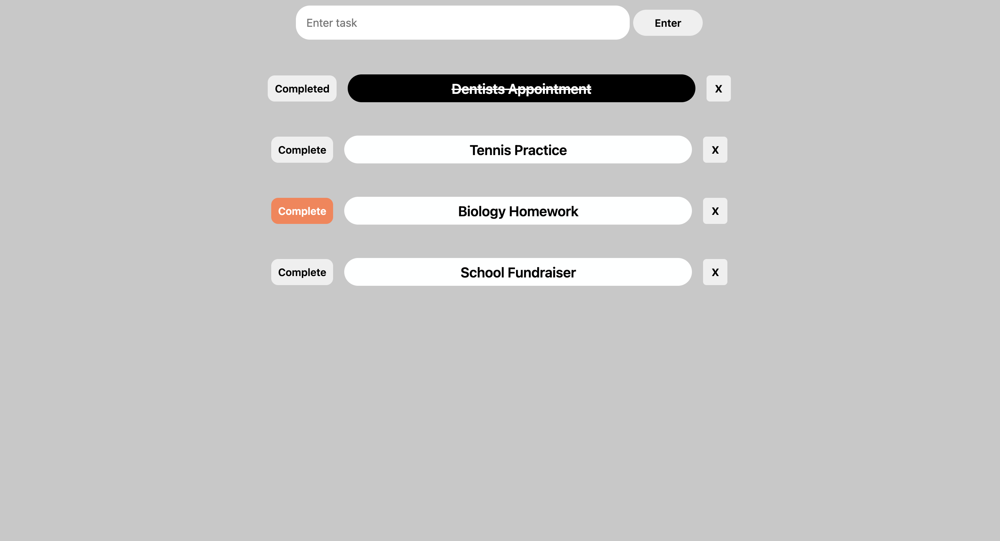

# ToDoList

This is my second JavaScript mini-project that involves a simple To-Do List where users can:
* add/delete tasks 
* check tasks that are complete 

Just like my first project, I utilized AI to help me through many of the concepts and core fundamentals, but I will continue to build until my JS proficiency is strong enough.

